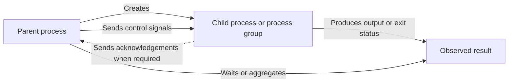

# Signal-Based Process Coordination in C

Signal-Based Process Coordination in C is a collection of six independent programs that explore how parent and child processes coordinate through operating system signals. The work presents progressively varied scenarios, including authorization and acknowledgement exchanges, targeted event delivery, execution suspension and resumption, orderly termination, request and response communication, and concurrent result aggregation. Together, the exercises provide a practical study of asynchronous process control, synchronization, timing, and lifecycle management in a POSIX environment.

## Overview

Each source file is a standalone exercise with its own entry point. The programs create one or more related processes, assign distinct responsibilities to them, and use signals or termination states to exchange control information. No command-line arguments, input files, or third-party libraries are required.

| Exercise | Scenario | Main coordination concepts |
| --- | --- | --- |
| `exercise_01.c` | Master and slave authorization sequence | `SIGUSR1` authorization, `SIGUSR2` acknowledgement, timed work, and explicit shutdown |
| `exercise_02.c` | Random dispatch to a five-process worker group | Multiple children, randomized target selection, and `SIGUSR1` or `SIGUSR2` handling |
| `exercise_03.c` | Suspension and resumption of a child workload | `SIGTSTP`, `SIGCONT`, waiting, and exit-status inspection |
| `exercise_04.c` | Coordinated notifications across five children | Group signaling, process ID parity, `SIGUSR1`, and a final `SIGQUIT` phase |
| `exercise_05.c` | Five-round Ping and Pong exchange | Bidirectional signaling, repeated synchronization, `SIGQUIT`, and child reaping |
| `exercise_06.c` | Concurrent simulation of five dice | Parallel children, randomized results encoded as exit statuses, and aggregation by the parent |

## Coordination model

The exact message flow varies by exercise, but the shared model is based on a parent process creating a child or a group of children and then coordinating their progress.



## Concepts demonstrated

- Parent and child process creation with the POSIX process model
- Signal disposition and handler registration
- Signal delivery between related processes
- Blocking while waiting for asynchronous events
- Process suspension, continuation, and termination
- Child collection and exit-status decoding
- Scheduler-dependent output ordering
- Randomized timing, routing, and result generation

## Requirements

The programs rely on POSIX process and signal facilities. Use one of the following environments:

- Linux with GCC or Clang
- macOS with the Xcode Command Line Tools
- Windows with Windows Subsystem for Linux and a Linux distribution

A C compiler available through the `cc` command is sufficient. The standard C library and operating-system interfaces used by the programs require no additional project dependencies.

## Environment setup

### Linux

Install a C compiler with the package manager for your distribution. For Debian or Ubuntu based systems:

```sh
sudo apt update
sudo apt install build-essential
```

For Fedora based systems:

```sh
sudo dnf install gcc
```

For Arch based systems:

```sh
sudo pacman -S gcc
```

### macOS

Install the Xcode Command Line Tools:

```sh
xcode-select --install
```

### Windows

The native Windows process model does not provide the POSIX behavior used by these exercises. Install Windows Subsystem for Linux from an elevated PowerShell terminal:

```powershell
wsl --install
```

Restart Windows if requested, open the installed Linux distribution, and install the compiler inside it:

```sh
sudo apt update
sudo apt install build-essential
```

Windows drives are available under `/mnt`. For example, a repository stored on the `C:` drive can be reached from WSL with:

```sh
cd /mnt/c/path/to/c-signal-based-process-coordination
```

## Build

Open a terminal in the repository root. On Windows, use the WSL terminal. Confirm that the compiler is available:

```sh
cc --version
```

Create a dedicated output directory and compile all six exercises:

```sh
mkdir -p build

for source in exercise_*.c; do
    cc -std=gnu11 -Wall -Wextra "$source" -o "build/${source%.c}"
done
```

The resulting executables are placed in `build` and keep the source file names without the `.c` extension.

To compile only one exercise, replace the file name and output name as needed:

```sh
cc -std=gnu11 -Wall -Wextra exercise_01.c -o build/exercise_01
```

## Run

Run the exercises individually from the repository root:

```sh
./build/exercise_01
./build/exercise_02
./build/exercise_03
./build/exercise_04
./build/exercise_05
./build/exercise_06
```

Execute one program at a time so that its process tree and console output remain isolated from the other exercises. Some scenarios intentionally include timed waits, random choices, or asynchronous output, so execution duration and message order can vary between runs. The console messages produced by the source programs are in Italian. Press `Ctrl+C` to interrupt the active process group when manual termination is desired.

## Clean generated files

Remove the compiled executables by deleting the build directory:

```sh
rm -rf build
```
